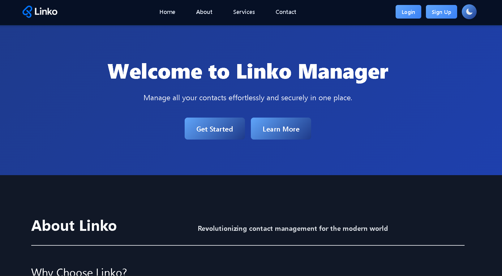
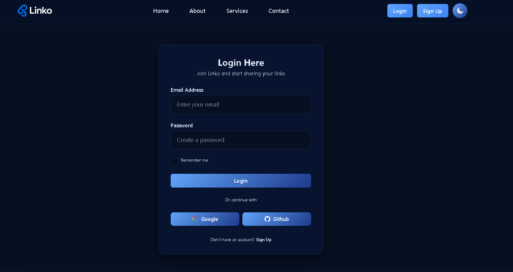
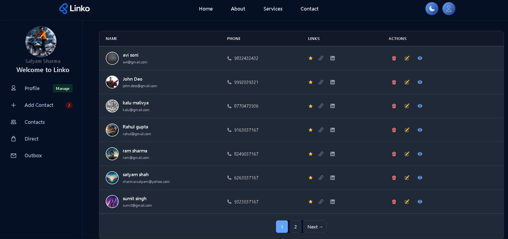
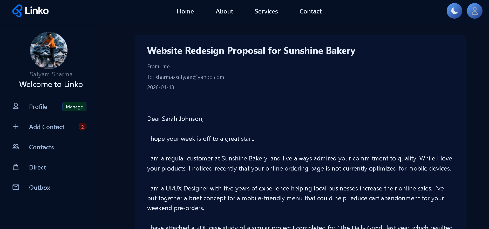
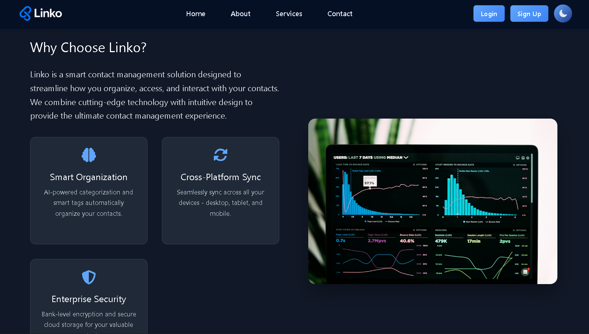

# Linko - Cloud Contact Manager 🌐📱

Linko is a modern, secure, and intuitive cloud-based contact management system built with Spring Boot. It allows users to store, organize, and manage their contacts efficiently from anywhere, with features like OAuth2 authentication, image storage, and email notifications.



---

## 🚀 Features

-   **🔒 Secure Authentication**: Integrated with Spring Security, supporting traditional login and OAuth2 (Google/GitHub).
-   **📂 Contact Management**: Full CRUD operations for contacts, including profile pictures and detailed information.
-   **☁️ Cloud Storage**: Seamless integration with **Cloudinary** for storing contact images.
-   **📧 Email Service**: Integrated Spring Mail for outbox notifications and communication.
-   **🎨 Modern UI**: Beautifully designed responsive interface using **Tailwind CSS** and **Thymeleaf**.
-   **⚡ Fast & Efficient**: Built with Spring Boot 3.x for high performance and scalability.
-   **📊 Dashboard**: Comprehensive dashboard for users to get an overview of their contacts.

---

## 📸 Screenshots

| Landing Page | Login Page |
| :---: | :---: |
|  |  |

| All Contacts | Email Outbox |
| :---: | :---: |
|  |  |

| About Page |
| :---: |
|  |

---

## 🛠️ Tech Stack

-   **Backend**: Java 17, Spring Boot 3.x
-   **Security**: Spring Security, OAuth2 (Google, GitHub)
-   **Database**: MySQL, Spring Data JPA
-   **Frontend**: Thymeleaf, Tailwind CSS, JavaScript
-   **Image Storage**: Cloudinary
-   **Email Service**: Spring Boot Starter Mail
-   **Build Tool**: Maven

---

## ⚙️ Installation & Setup

### Prerequisites
-   **JDK 17** or higher
-   **MySQL** Database
-   **Cloudinary Account** (for image storage)
-   **Google/GitHub Developer Console** (for OAuth2)

### Steps

1.  **Clone the repository**:
    ```bash
    git clone https://github.com/Satyam061706/Linko.git
    cd Linko
    ```

2.  **Configure Database**:
    - Create a database named `linko` in MySQL.
    - Update `src/main/resources/application.properties` with your credentials:
      ```properties
      spring.datasource.url=jdbc:mysql://localhost:3306/linko
      spring.datasource.username=your_username
      spring.datasource.password=your_password
      ```

3.  **Configure Cloudinary & OAuth2**:
    - Add your Cloudinary API keys and OAuth2 client IDs in `application.properties` or environment variables.

4.  **Install Frontend Dependencies**:
    ```bash
    npm install
    ```

5.  **Build and Run**:
    - Using Maven:
      ```bash
      ./mvnw spring-boot:run
      ```
    - Or use the provided batch file:
      ```bash
      ./Run-Linko.bat
      ```

---

## 🤝 Contributing

Contributions are welcome! If you find any issues or have suggestions for improvements, feel free to open an issue or submit a pull request.

---

## 📄 License

This project is licensed under the MIT License.

---

Developed with ❤️ by [Satyam](https://github.com/Satyam061706)
